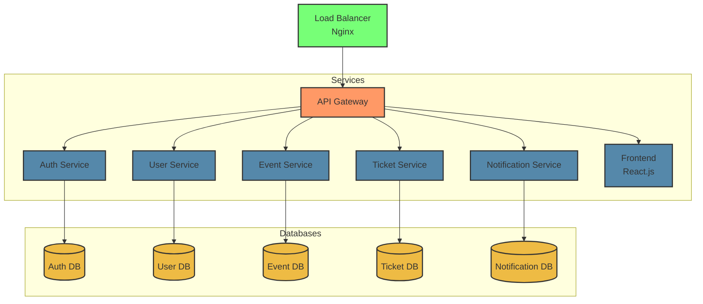

# Event Ticketing System - Microservices Architecture


**Project Team 4WEBD**

   - Saad Chabba
   - Hamza Belyahiaoui


A scalable event ticketing system built with Laravel microservices architecture, designed to handle both small-scale events and large international concerts.

## Architecture Overview

The system is composed of the following microservices:

1. **API Gateway** (Port 8000)
   - Entry point for all client requests
   - Handles request routing and load balancing
   - Manages service discovery

2. **Auth Service** (Port 8001)
   - Handles authentication and authorization
   - JWT token management
   - User roles: Admin, EventCreator, Operator, User

3. **User Service** (Port 8002)
   - User profile management
   - User purchase history
   - Account settings

4. **Event Service** (Port 8003)
   - Event CRUD operations
   - Event capacity management
   - Event details and scheduling

5. **Ticket Service** (Port 8004)
   - Ticket purchasing and management
   - Payment processing
   - Ticket validation and verification

6. **Notification Service** (Port 8005)
   - Handles email/SMS notifications
   - Purchase confirmations
   - Event updates

7. **Frontend** (Port 3000)
   - React.js web application
   - User interface for all operations

8. **Load Balancer** (Port 80)
   - Nginx load balancer
   - Request distribution
   - High availability

## Architecture Overview

The system is composed of the following microservices:

1. **React**
We chose React.js for the frontend to ensure a smooth, high-performance, and scalable application.

- Performance: Virtual DOM enables fast updates.
- Modularity: Reusable components for efficient development.
- User Experience: Interactive and dynamic interface.
- Rich Ecosystem: Easy integration with Redux, React Router, and APIs.
- Scalability: Easy to maintain and expand.

React.js allows us to deliver a modern, fast, and intuitive platform for event management. 

1. **Laravel**
We chose Laravel for the backend to ensure a robust, secure, and scalable application.

- Performance: Optimized framework with caching and Eloquent ORM.
- Security: Built-in protection against SQL injection, CSRF, and authentication.
- Modularity: MVC architecture for easy maintenance and scalability.
- API Ready: Seamless creation of RESTful APIs to communicate with the React.js frontend.
- Rich Ecosystem: Native integration with Laravel Passport, Sanctum, and queues for background tasks.

Laravel enables us to build a reliable, high-performance, and scalable event management solution. 🚀


## System Architecture




## Features

- User authentication and authorization
- Event creation and management
- Secure ticket purchasing
- Automated email notifications after each purchase or cancel
- Payment processing
- Ticket validation
- User purchase history
- Admin dashboard

## Prerequisites

- Docker
- Docker Compose
- Git

## Installation

1. Clone the repository:
```bash
git clone https://github.com/chabbasaad/Events_Microservices &&
cd laravel_Microservices
```

2. Build and start the containers:
```bash
docker-compose up -d
```

3. run command for Queue work for notification
```bash
php artisan queue:work
```

## Demo User Accounts

The system comes with pre-configured demo accounts for testing purposes:

1. **Admin User**
   - Email: admin@example.com
   - Password: password
   - Role: Admin
   - Full system access

2. **Event Creator**
   - Email: eventcreator@example.com
   - Password: password
   - Role: Event Creator
   - Can create and manage events

3. **Operator**
   - Email: operator@example.com
   - Password: password
   - Role: Operator
   - Can manage tickets and operations

4. **Regular User**
   - Email: user@example.com
   - Password: password
   - Role: User
   - Standard user privileges


## Service URLs

- Frontend: http://localhost:3000
- API Gateway: http://localhost:8000
- Auth Service: http://localhost:8001
- User Service: http://localhost:8002
- Event Service: http://localhost:8003
- Ticket Service: http://localhost:8004
- Notification Service: http://localhost:8005

## API Documentation

API documentation is available at the following URLs:
- Auth Service: http://localhost:8001/docs/api
- User Service: http://localhost:8002/docs/api
- Event Service: http://localhost:8003/docs/api
- Ticket Service: http://localhost:8004/docs/api

## Security Features

- JWT-based authentication
- Password encryption
- Rate limiting
- CORS protection
- Database backup scheduling
- Secure payment processing with Firebase backup (https://appfirebase-f3747-default-rtdb.firebaseio.com/)
- Daily automated payment backups to Firebase Realtime Database
- Ticket-user matching for validation

## Error Handling

- Comprehensive error logging in each service
- Asynchronous notification system for failed operations
- Transaction rollback for failed purchases
- Automatic retry mechanism for failed notifications

## Logs

- Each service maintains its own logs at `storage/logs/laravel.log`


## Laodblancer 

We have set up this NGINX configuration to act as the main entry point (API Gateway) in our microservices architecture. Here’s how it works:

Basic Server Configuration:
Our server listens on port 80.

We have set the server name to localhost.

Frontend Handling:
The root route / redirects directly to our frontend service, which runs on port 80.

We have also configured it to forward origin headers (Host, Real-IP, etc.) for better request handling.

API Gateway Setup:
All requests sent to /api/ are redirected to our API Gateway service, which runs on port 8000.

This central point allows us to manage and dispatch requests to the appropriate services without exposing direct access.

Direct Access to Services (For Testing & Debugging):
To facilitate monitoring and testing, we have set up specific routes for direct service access:
```bash
/auth/ → auth-service (port 8001)

/users/ → user-service (port 8002)

/events/ → event-service (port 8003)

/tickets/ → ticket-service (port 8004)

/notifications/ → notification-service (port 8005)
```
Load Balancing Mechanism
Beyond simple request redirection, our configuration also acts as a Load Balancer, efficiently distributing incoming requests to the appropriate services. This helps optimize performance and scalability across our system.

With this setup, we have a structured, high-performance, and easily extensible architecture for our project.
